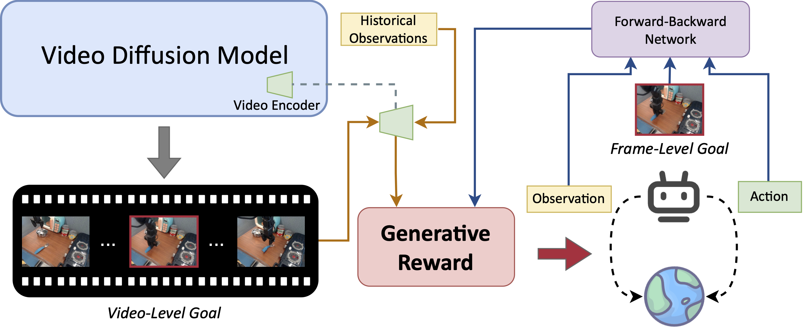

<h1 align="center">
 [CVPR 2026] <i>Goal-Driven Reward by Video Diffusion Models for Reinforcement Learning</i> </h1>
<p align="center">
Qi Wang* · Mian Wu* · Yuyang Zhang* · Mingqi Yuan · Wenyao Zhang · Yunbo Wang · Xin Jin† · Xiaokang Yang · Wenjun Zeng
</p>

<h3 align="center"> <a href="https://www.arxiv.org/pdf/2512.00961" target="_blank"> arXiv </a> &nbsp;&nbsp; | &nbsp;&nbsp; <a href="https://qiwang067.github.io/genreward" target="_blank"> Project Page </a> </h3>
  <div align="center"></div>

<p align="center">

</p>

<p style="text-align:justify">
Reinforcement Learning (RL) has achieved remarkable success in various domains, yet it often relies on carefully designed programmatic reward functions to guide agent behavior. Designing such reward functions can be challenging and may not generalize well across different tasks. To address this limitation, we leverage the rich world knowledge contained in pretrained video diffusion models to provide goal-driven reward signals for RL agents without ad-hoc design of reward. Our key idea is to exploit off-the-shelf video diffusion models pretrained on large-scale video datasets as informative reward functions in terms of video-level and frame-level goals. For video-level rewards, we first finetune a pretrained video diffusion model on domain-specific datasets and then employ its video encoder to evaluate the alignment between the latent representations of agent's trajectories and the generated goal videos. To enable more fine-grained goal-achievement, we derive a frame-level goal by identifying the most relevant frame from the generated video using CLIP, which serves as the goal state. We then employ a learned forward–backward representation that represents the probability of visiting the goal state from a given state–action pair as frame-level reward, promoting more coherent and goal-driven trajectories. Experiments on various Meta-World tasks demonstrate the effectiveness of our approach.
</p>


## Getting Started

### 1) Create an environment
```bash
conda create -n genreward python=3.11
conda activate genreward
```

### 2) Install dependencies
```bash
pip install -r requirements.txt
```

### 3) Environment-specific setup

For Meta-World environments:
```bash
pip install git+https://github.com/rlworkgroup/metaworld.git@a0009ed9a208ff9864a5c1368c04c273bb20dd06#egg=metaworld
```

## Training

### Meta-World Tasks
```bash
# Pick place task
bash run_gc_mt_pick.bash

# Pick out of hole task
bash run_gc_mt_pick_hole.bash

# Bin picking
bash run_gc_mt_pick_bin.bash
```

## Citation

**If you find this work useful in your research, please consider citing:**
```bib
@inproceedings{wang2026goal,
  title={Goal-Driven Reward by Video Diffusion Models for Reinforcement Learning},
  author={Wang, Qi and Wu, Mian and Zhang, Yuyang and Yuan, Mingqi and Zhang, Wenyao and You, Haoxiang and Wang, Yunbo and Jin, Xin and Yang, Xiaokang and Zeng, Wenjun},
   booktitle={CVPR},
  year={2026}
}
```

## Credits

This implementation builds upon and is inspired by:
- [DreamerV3](https://github.com/danijar/dreamerv3) - Original DreamerV3 implementation
- [dreamerv3-torch](https://github.com/NM512/dreamerv3-torch) - PyTorch implementation of DreamerV3
- [Meta-World](https://github.com/Farama-Foundation/Metaworld) - Robotic manipulation benchmark

Thanks to all the authors for their excellent work!

